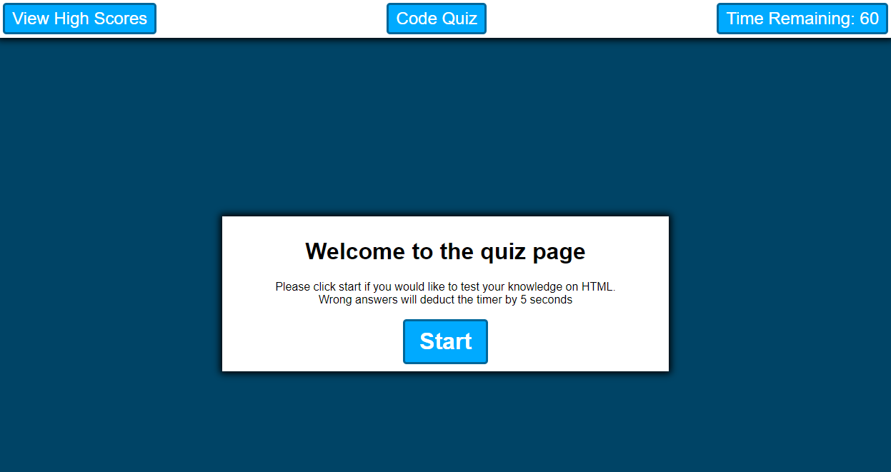

# CodingQuiz

Created a quiz on HTML using javascript

## Project Links

[GitHub Repository](https://github.com/JosephCordell/CodingQuiz)

[Webpage](https://josephcordell.github.io/CodingQuiz/)

## Screenshot of webpage

## Features
- A quiz with 10 randomized questions
- A countdown timer that starts at 60 seconds
- High Score page with a reset button

## What I learned

- How to hide elements
- Creating a timer that reacts to elements on the page
- How to utilize local storage